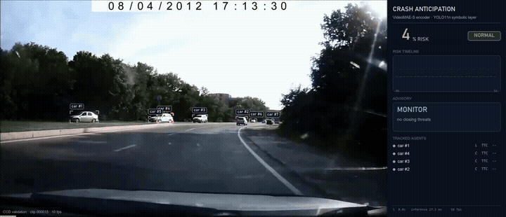
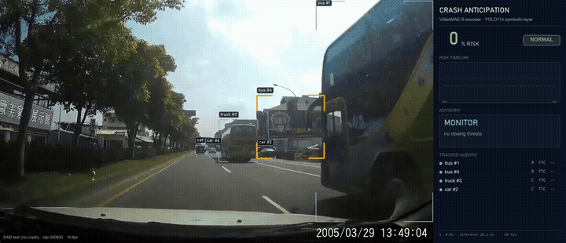
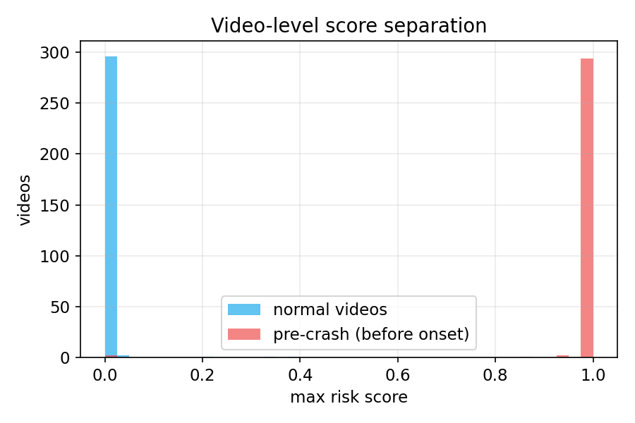
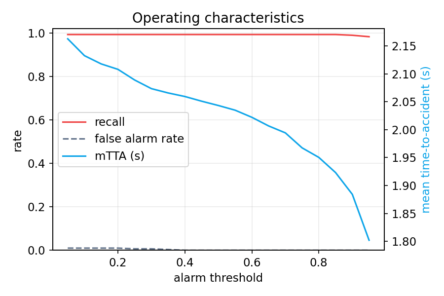
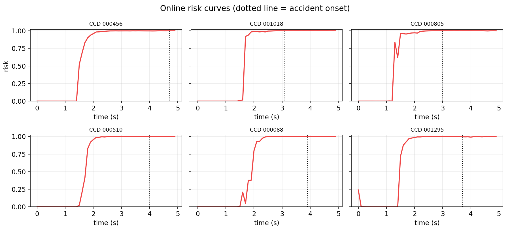
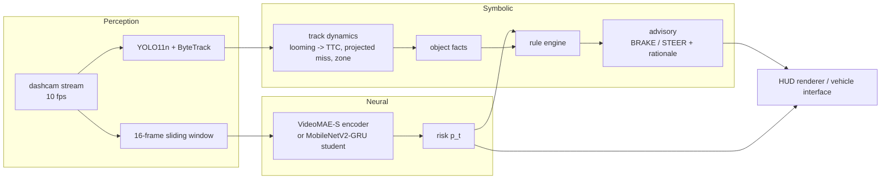

# Crash Anticipation

**Neurosymbolic crash anticipation from dashcam video** — a neural video model predicts collision risk *seconds before impact*, while a symbolic reasoning layer grounds every alarm in tracked objects, physics-based time-to-collision, and an auditable rule engine that issues actionable avoidance commands ("BRAKE HARD + STEER RIGHT") with a human-readable rationale.

`Computer Vision` · `VideoMAE` · `Knowledge Distillation` · `Neurosymbolic AI` · `Autonomous Driving`

<p align="center">
  
</p>
<p align="center"><i>Online inference on a CCD validation clip: the risk timeline rises before impact, the tracked threat is localized with a falling TTC, and the rule engine escalates from MONITOR to BRAKE — the footer reports how many seconds of warning the driver got.</i></p>

<p align="center">
  
</p>
<p align="center"><i>Contrast case — a no-crash DAD test clip: risk stays flat, and the symbolic layer's projected-miss test (a scale-invariant constant-bearing rule) correctly refuses to flag a bus that looms only because we are passing it.</i></p>

---

## The headline finding: the old benchmark was broken, so I rebuilt it

The previous iteration of this project reported **AP = 1.0, F1 = 1.0** and called the benchmark "saturated." Auditing it revealed something worse and more interesting: **every sample in both the train and validation manifests was labeled positive.** The Car Crash Dataset (CCD) manifests only contained crash videos, so the model had learned to output `p = 1.0` for *every input* — a constant predictor with perfect scores on a benchmark with no negatives.

The rework starts from the task formulation:

| | Before | After |
|---|---|---|
| **Task** | Classify one pre-sampled clip per video | **Online anticipation**: risk estimate at every frame of a stream |
| **Negatives** | None (all 1,500 samples positive) | **1,130 real no-crash videos (DAD)** + same-domain temporal negatives |
| **Labels** | Video-level binary | Time-to-event per window, exponential earliness weighting |
| **Metrics** | AP on all-positive set (trivially 1.0) | Video AP/AUROC on pre-onset risk, **mTTA**, false-alarm rate, per-condition breakdown |
| **Verdict** | Constant `p=1.0` scores perfectly | A constant predictor now scores AP ≈ 0.5 (positive prevalence) |

## Results

Online evaluation over **300 CCD crash videos + 301 held-out DAD no-crash videos**, streamed frame-by-frame exactly as in deployment. Positives are scored by their maximum risk *before* accident onset — firing after impact does not count.

| model | params | video AP | AUROC | recall@0.5 | false alarms / neg. video | mTTA | framewise AP (same-domain) | window latency (RTX 5070 Ti) | streaming |
|---|---|---|---|---|---|---|---|---|---|
| **VideoMAE-S (teacher)** | 21.88 M | **0.9998** | 0.9998 | 0.993 | **0.000** | 2.04 s | **0.976** | 16.9 ms (59 fps) | — |
| **MobileNetV2-GRU (student)** | **2.95 M** | 0.9998 | 0.9998 | 0.993 | 0.010 | **3.05 s** | 0.971 | 3.4 ms (295 fps) | **2.45 ms/frame (408 fps)** |

- **mTTA** (mean time-to-accident): how many seconds before impact the alarm fires, averaged over detected crashes at the 0.5 threshold. The distilled student fires a full second *earlier* than its teacher (3.05 s vs 2.04 s), trading 3 false alarms across 301 no-crash videos against the teacher's 0.
- **Framewise AP (same-domain)**: pre-onset frames vs. early frames *of the same crash videos* — verifies the model reads the scene rather than exploiting the visual domain gap between datasets.
- The student runs **causally**: one MobileNetV2 forward + GRU update per new frame, no window re-encoding — the deployment path for embedded automotive hardware. At 2.45 ms/frame it processes a 10 fps dashcam stream at 2.4 % GPU duty cycle on desktop hardware, leaving generous headroom for automotive-grade SoCs.

<p align="center">
  
  
</p>
<p align="center">
  
</p>

### Per-condition breakdown (teacher)

| condition | n | AP | recall@0.5 | mTTA |
|---|---|---|---|---|
| weather: Normal | 232 | 0.9997 | 0.991 | 2.03 s |
| weather: Rainy | 18 | 1.0000 | 1.000 | 1.93 s |
| weather: Snowy | 50 | 1.0000 | 1.000 | 2.16 s |
| timing: Day | 259 | 0.9998 | 0.992 | 2.05 s |
| timing: Night | 41 | 1.0000 | 1.000 | 1.99 s |
| ego-involved: No | 139 | 0.9995 | 0.993 | 1.99 s |
| ego-involved: Yes | 161 | 0.9997 | 0.994 | 2.09 s |

Performance is uniform across weather, lighting, and ego-involvement — no failure pocket hiding in the aggregate numbers.

## Architecture



**Neural risk.** A video encoder sees the last 1.6 s of frames and outputs the probability that a crash is imminent. Training uses an earliness-weighted BCE (after [Chan et al., 2016](https://github.com/smallcorgi/Anticipating-Accidents)): windows ending `tte` seconds before the accident get positive weight `exp(-tte/τ)` inside a 1.5 s anticipation horizon, windows ≥ 2.5 s before it are same-domain negatives, and the ambiguous band between contributes no gradient. Real negatives come from DAD's 1,130 no-crash dashcam videos.

**Symbolic layer.** YOLO11n + ByteTrack maintain persistent tracks of road agents. For each track, monocular **time-to-collision** comes from the classical looming result `TTC = 1 / (d log s / dt)` (least-squares over a short history for jitter robustness). Whether the object is actually converging on the ego vehicle is decided by projecting its track to the moment of closest approach: for constant relative velocity the lateral offset at that moment is `ẋ · TTC` in image pixels, and dividing by the object's own box width converts it to physical vehicle-widths without any depth estimate — a **scale-invariant constant-bearing test**. A car being overtaken one lane over projects to a ~2-width miss and stays quiet no matter how fast we close on it; a cut-in converging on our lane projects to a near-zero miss and alarms even while it drifts across the image. The rule engine fuses neural risk with these facts:

| rule | condition | output |
|---|---|---|
| 1 | risk ≥ 0.65 **and** tracked threat with TTC ≤ 2 s | evasive command (`BRAKE HARD`, `BRAKE + STEER LEFT/RIGHT` toward the clear side) |
| 2 | risk ≥ 0.65, no confirming track | `BRAKE` — learned risk trusted even when the threat is occluded/unnamed |
| 3 | risk ≥ 0.40 **or** any TTC ≤ 3.5 s | `COVER BRAKE` |
| 4 | otherwise | `MONITOR` |

Every advisory carries its rationale (e.g. *"car ahead closing, TTC 1.1 s; learned risk 99%"*) — the system's recommendations are auditable, which is the point of putting symbols on top of the network.

**Compression.** The MobileNetV2 + GRU student is distilled from the VideoMAE teacher (soft targets + earliness-weighted hard labels). Because its recurrence is causal, each new frame costs one lightweight CNN forward instead of re-encoding a 16-frame window — the difference between research throughput and an embedded deployment budget.

## Quickstart

```bash
# Environment (CUDA build of PyTorch recommended)
python -m venv .venv && .venv\Scripts\activate
pip install -r requirements.txt

# Data: place CCD frames + manifests and DAD videos under data/manifests/
#   CCD:  data/manifests/car-crash-dataset-ccd/CrashBest  (+ ccd_train.csv / ccd_val.csv)
#   DAD:  data/manifests/Anticipating-Accidents-in-Dashcam-Videos/videos/{training,testing}/{positive,negative}
python data/manifests/create_ccd_manifests.py --table data/manifests/car-crash-dataset-ccd/Crash_Table.csv --output data/manifests

# Train the VideoMAE teacher, then distill the student
python train.py --config configs/anticipation.yaml
python train.py --config configs/student_distill.yaml

# Evaluate online (streams every eval video frame-by-frame)
python evaluate.py --config configs/anticipation.yaml  --checkpoint outputs/videomae_anticipation/best.pt  --name videomae
python evaluate.py --config configs/student_distill.yaml --checkpoint outputs/student_mobilenet_gru/best.pt --name student

# Latency comparison
python benchmark_latency.py --device cuda

# Render demo videos (HUD + symbolic overlays); --auto picks presentable clips
python demo/render_demo.py --auto 4 --include-negative --gif

# Tests
python -m pytest tests/ -q
```

## Repository structure

```
crash_anticipation/
  config.py                 YAML experiment configuration
  data/datasets/windows.py  windowed online-anticipation dataset (CCD + DAD)
  models/videomae.py        VideoMAE-S teacher
  models/mobilenet_temporal.py  MobileNetV2-GRU streaming student
  training/losses.py        earliness-weighted BCE + distillation loss
  training/engine.py        train/eval loops
  inference/predictor.py    online sliding-window predictor (deployment path)
  symbolic/perception.py    YOLO11n + ByteTrack road-agent tracking
  symbolic/dynamics.py      looming -> TTC, projected-miss collision-course test
  symbolic/rules.py         advisory rule engine (auditable decisions)
configs/                    anticipation.yaml (teacher), student_distill.yaml
demo/render_demo.py         HUD demo renderer (PIL supersampled overlays)
demo/make_reel.py           2x2 showcase reel builder
evaluate.py                 online evaluation protocol
benchmark_latency.py        teacher/student latency + footprint comparison
tests/                      fast, data-free unit tests for the core logic
```

## Honest limitations

- **Cross-dataset negatives.** Crash videos come from CCD (global YouTube footage), no-crash videos from DAD (Taiwan dashcams). A model could partly separate them by domain cues; the same-domain framewise AP and CCD temporal negatives in training are the guard against this, but an ideal benchmark would draw both classes from one distribution (CCD's 3,000 BDD-sourced normal clips are the planned fix).
- **TTC is monocular and heuristic.** Bounding-box looming breaks under occlusion, non-rigid motion, and rotation; it is an explanatory signal, not a measurement device.
- **Advisories are not control commands.** Rules are demonstrably sensible on this data but are not validated against vehicle dynamics or a safety case; treat them as an interpretability layer.
- **5-second clips.** Both datasets are short clips with the accident near the end; long-horizon false-alarm behavior over hours of driving is unmeasured.

## Roadmap

- Single-domain benchmark with CCD normal clips; cross-condition *training* splits (train day → test night).
- DADA-2000 integration for driver-attention supervision.
- INT8 / TensorRT export of the student; on-device (Jetson-class) latency numbers.
- Ego-motion compensation and metric TTC via monocular depth.
- Closed-loop evaluation of advisories in CARLA.

## Acknowledgements

- [Car Crash Dataset (CCD)](https://github.com/Cogito2012/CarCrashDataset) — crash videos with per-frame accident annotations.
- [DAD: Anticipating Accidents in Dashcam Videos](https://github.com/smallcorgi/Anticipating-Accidents) (Chan et al., ACCV 2016) — negative pool and the exponential anticipation-loss idea.
- [VideoMAE](https://github.com/MCG-NJU/VideoMAE) checkpoints via Hugging Face; [Ultralytics YOLO11](https://github.com/ultralytics/ultralytics) for detection.

MIT License.
